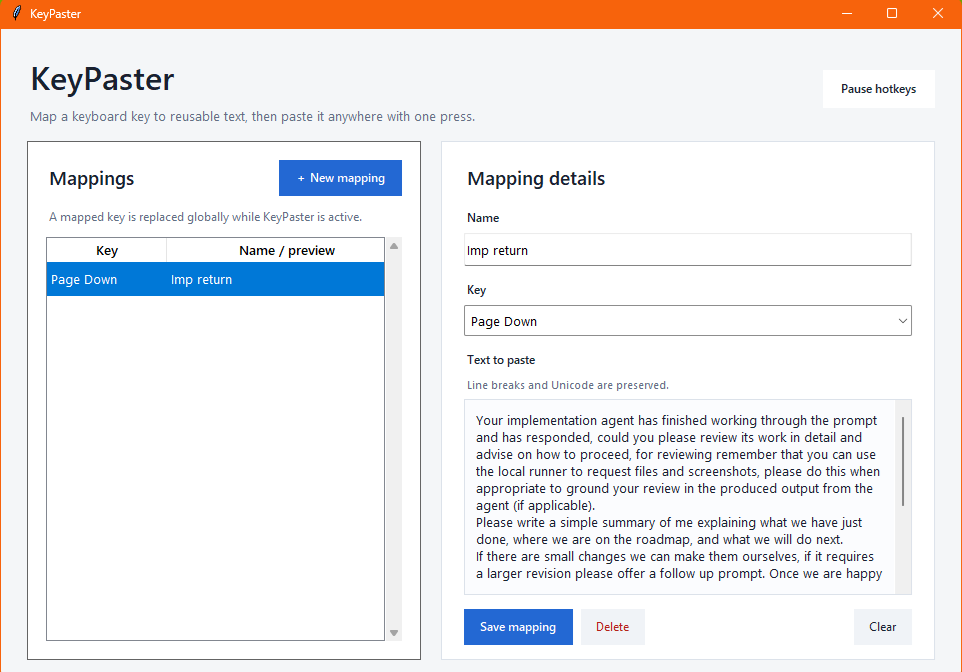

# KeyPaster

KeyPaster is a small Windows utility built entirely in **Python**.

Map a keyboard key to:

- reusable text
- volume up/down or mute
- play/pause, next track, previous track, or stop

For text mappings, KeyPaster saves your clipboard, pastes the text, then restores your previous clipboard. It is useful as a simple AutoHotkey replacement for fixed text shortcuts, especially repeated prompts when managing multiple AI or coding agents.

## Install

**Requires Windows 10/11 and Python 3.11+.**

1. Download with **Code > Download ZIP**.
2. Extract it.
3. Double-click `Run-KeyPaster.bat`.

## Use

1. Click **New mapping**.
2. Choose a key and action.
3. Add text if using **Paste text**.
4. Click **Save mapping**.

Mappings are saved between launches.

Tray hiding is optional. Enable **Minimize to tray** or **Close to tray** in KeyPaster if you want it.

To build a standalone executable, run `Build-KeyPaster.bat`.
